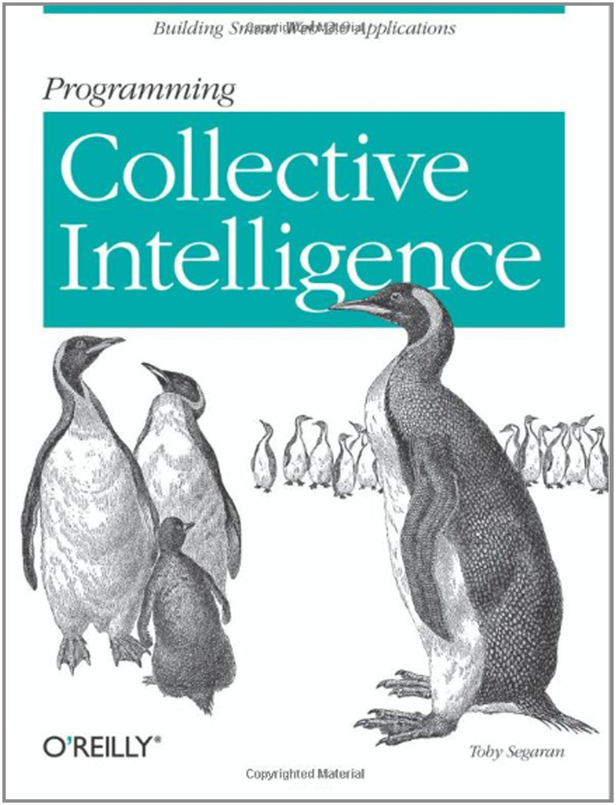

# Recommender Systems From Scratch with Python


Lets look at the chapter 2 of the book _Collective Intelligence_ which is written by Toby Segaran. Here, for the recommendation of movies, we start with a toy data and than we will use movielens dataset.


<p style="text-align:center;"></p>


## Dictionary Review in Python

A dictionary is a symbol-table. We store (key:value) pairs in a dictionary. Lets see how to add, update and delete pairs in a dictionary.


```python
##############################################################################
# A dictionary of some movies and their ratings for Uzay
# This dictionary uses a ranking from 1 to 5
Uzay = {'Superman Returns': 3.0, 'Gladiator': 4.0}
print("Critics of Uzay on the movie Superman Returns: ", Uzay['Superman Returns'])
```

    Critics of Uzay on the movie Superman Returns:  3.0


```python
# add new key:value pair to the dictionary by command <dict>.setdefault("<key>", <value>)
Uzay.setdefault("Star Wars", 4.0)
print("Critics of Uzay: ",Uzay)
```

    Critics of Uzay:  {'Superman Returns': 3.0, 'Gladiator': 4.0, 'Star Wars': 4.0}


```python
Uzay['Star Wars'] = Uzay['Star Wars'] + 0.5
Uzay.setdefault("Star Wars", 0.0) # This does not make Uzay['Star Wars'] to zero
print("Critics of Uzay: ",Uzay)
```

    Critics of Uzay:  {'Superman Returns': 3.0, 'Gladiator': 4.0, 'Star Wars': 4.5}


```python
# Deletion
del Uzay['Superman Returns']
print("Critics of Uzay: ",Uzay)
```

    Critics of Uzay:  {'Gladiator': 4.0, 'Star Wars': 4.5}


```python
# Update
Uzay['Gladiator'] = 4.5
print("Critics of Uzay: ",Uzay)
```

    Critics of Uzay:  {'Gladiator': 4.5, 'Star Wars': 4.5}


### Toy Data
First we start with a toy data. Data will be stored in a nested dictionary.


```python
##############################################################################
# A Nested Dictionary of movie critics a
# Outer Dictionary: Key is person, Value is a set of critics
# Inner Dictionary: Key is movie , Value is a rating score
critics={
    'Selin':{'Star Wars':1.0,'Amelie':5.0,'Gladiator':1.0},
    'Ahmet':{'Star Wars':5.0,'Amelie':3.0,'Gladiator':4.0},
    'Fatih':{'Star Wars':4.0,'Amelie':3.5,'Gladiator':5.0},
    'Uzay': {'Gladiator':5.0}
}
print("Uzay's critics for the movie Lady Gladiator: ", critics['Uzay']['Gladiator'])
```

    Uzay's critics for the movie Lady Gladiator:  5.0


```python
# People in our toy data
for person in critics.keys():
    print(person)
```

    Selin
    Ahmet
    Fatih
    Uzay


## Recommendation Engine

    * Find people who share tastes
    * Make recommendations based on what similar people like

### Prediction based on others rating score
<p style="text-align:center;"></p>

Above you see two cases, 

#### in case I
Uzay is equally similar to all of his friends. Suppose all of his friends watched a movie m that Uzay has not seen yet. What do you expect to be Uzay's rating on the movie m?

$$
score(Uzay, m) =\frac{1}{n} \sum score(friend, m) = 
\frac{4 + 1 + 5}{3} = 3.3
$$

Here n is number of friends. However, this is not realistic. In real life, people's preferences are different from one another. 
#### in case II
we have similarities. What we expect is, more similar friends should have a higher impact on determining Uzay's rating score.

$$
score(Uzay, m) =\frac{\sum sim(Uzay, friend) \times score(friend, m)}{\sum sim(Uzay, friend)}  = 
\frac{1.0 \times  4 + 0.2 \times 1 + 0.5 \times  5}{1.0 + 0.2 + 0.5} = 3.94
$$

This is called weighted sum. And since the weight(similarity) of Fatih is bigger result is more close to Fatih's rating score and more distant than less similar friends ratings. 

### Which movie to recommend?
<p style="text-align:center;"></p>

Predict Uzay's rating for the movie Amelie
$$
score(Uzay, Amelie) =
\frac{1.0 \times  3.5 + 0.2 \times 5 + 0.5 \times  3}{1.0 + 0.2 + 0.5} = 3.82
$$

Predict Uzay's rating for the movie Star Wars
$$
score(Uzay, Star Wars) =
\frac{1.0 \times  4 + 0.2 \times 1 + 0.5 \times  5}{1.0 + 0.2 + 0.5} = 3.94
$$

If you are to recommend one movie, you should select the movie which has maximum predicted score. That is Star Wars !


## Compute Similarity 
We have seen how to store our data and how to predict one's score to make recommendation. One piece is missing how to calculate similarity of two person?

#### Similarity Based on Euclidean Distance
Similarity between the preferences of two people is inversely proportional to their euclidean distance. We add 1 to euclidean distance to avoid division-by-zero error.

$$
sim(a,b) = \frac{1}{1+dist(a,b)}
$$


```python
from math import sqrt
def dist(prefs,person1,person2,item):
    """ Compute Euclidean Distance
    between two person's preference on the item
    based on the given nested dictionary
    """
    difference = prefs[person1][item] - prefs[person2][item]
    return pow(difference, 2)

print(dist(critics, 'Uzay', 'Selin', 'Gladiator'))
```

    16.0


```python
print(dist(critics, 'Uzay', 'Ahmet', 'Gladiator'))
```

    1.0


Lets look at our dataset:

|               |  Star Wars  | Amelie         | Gladiator         |
| ------------- | ------------- | ------------- |------------- |
| Fatih         | 4 | 3.5| 5|
| Selin         | 1 | 5| 1|
| Ahmet         | 5 | 3| 4|
| Uzay          | ? | ?| 5|

If we represent our dataset in x-y coordinate system,
where x-axis is the score for the movie Star Wars
and y-axis is the score for the movie Amelie
<p style="text-align:center;"></p>


```python
##############################################################################
# A Nested Dictionary of movie critics a
# Outer Dictionary: Key is person, Value is a set of critics
# Inner Dictionary: Key is movie , Value is a rating score
critics={
    'Selin':{'Star Wars':1.0,'Amelie':5.0,'Gladiator':1.0},
    'Ahmet':{'Star Wars':5.0,'Amelie':3.0,'Gladiator':4.0},
    'Fatih':{'Star Wars':4.0,'Amelie':3.5,'Gladiator':5.0},
    'Uzay': {'Gladiator':5.0}
}
print(dist(critics, 'Selin', 'Ahmet', 'Star Wars'))
print(dist(critics, 'Selin', 'Ahmet', 'Amelie'))
```

    16.0
    4.0


```python
def intersection(prefs,person1,person2):
    # Get the list of shared_items
    si={}
    for item in prefs[person1]:
        if item in prefs[person2]:
            si[item]=1
    return si
```


```python
# Returns a distance-based similarity score for person1 and person2
def sim_distance(prefs,person1,person2):
    common = intersection(prefs,person1,person2)
    # if they have no ratings in common, return 0
    if len(common)==0: return 0
    # Add up the squares of all the differences for common movies
    sum_of_squares = sum([dist(prefs,person1,person2,movie) for movie in common])
    return 1 / (1 + sqrt(sum_of_squares))
```


```python
print("\nSim(Uzay, Fatih) =  ", sim_distance(critics,'Uzay','Fatih'))
print("Sim(Uzay, Selin) =  ", sim_distance(critics,'Uzay','Selin'))
print("Sim(Uzay, Ahmet) =  ", sim_distance(critics,'Uzay','Ahmet'))
```

    
    Sim(Uzay, Fatih) =   1.0
    Sim(Uzay, Selin) =   0.2
    Sim(Uzay, Ahmet) =   0.5


#### Similarity Based on Pearson correlation coefficient

How much the variables change together divided by the product of how much they vary individually.

> Better for unnormalized data where some people make routinely more harshed critics than others. It corrects for grade inflation.


```python
# This function will return a value between –1 and 1.
# Returns the Pearson correlation coefficient for p1 and p2
def sim_pearson(prefs,p1,p2):
    # Get the list of mutually rated items
    si=intersection(prefs,p1,p2)
    # Find the number of elements
    n=len(si)
    # if they are no ratings in common, return 0
    if n==0: return 0
    # Add up all the preferences
    sum1=sum([prefs[p1][it] for it in si])
    sum2=sum([prefs[p2][it] for it in si])
    # Sum up the squares
    sum1Sq=sum([pow(prefs[p1][it],2) for it in si])
    sum2Sq=sum([pow(prefs[p2][it],2) for it in si])
    # Sum up the products
    pSum=sum([prefs[p1][it]*prefs[p2][it] for it in si])
    # Calculate Pearson score
    num=pSum-(sum1*sum2/n)
    den=sqrt((sum1Sq-pow(sum1,2)/n)*(sum2Sq-pow(sum2,2)/n))
    if den==0: return 0
    r=num/den
    return r


print("\nSim(Uzay, Fatih)  = ", sim_pearson(critics,'Uzay','Fatih'))
print("Sim(Fatih, Selin) = ", sim_pearson(critics,'Fatih','Selin'))
print("Sim(Fatih, Ahmet) = ", sim_pearson(critics,'Fatih','Ahmet'))
print("Sim(Selin, Ahmet) = ", sim_pearson(critics,'Selin','Ahmet'))
```

    
    Sim(Uzay, Fatih)  =  0
    Sim(Fatih, Selin) =  -0.7559289460184555
    Sim(Fatih, Ahmet) =  0.3273268353539889
    Sim(Selin, Ahmet) =  -0.8660254037844385


```python
##############################################################################
# Returns the best matches for person from the prefs dictionary.
# Number of results and similarity function are optional params.
def topMatches(prefs,person,n=5,similarity=sim_distance):
    scores=[(similarity(prefs,person,other),other) for other in prefs if other!=person]
    # Sort the list so the highest scores appear at the top
    scores.sort( )
    scores.reverse( )
    return scores[0:n]
```


```python
print("\nSimilar (top-3) person like Uzay: ", 
      topMatches(critics,'Uzay',n=3,similarity=sim_distance));
```

    
    Similar (top-3) person like Uzay:  [(1.0, 'Fatih'), (0.5, 'Ahmet'), (0.2, 'Selin')]


```python
# Gets recommendations for a person by using a weighted average
# of every other user's rankings
def getRecommendations(prefs,person,similarity=sim_distance):
    totals={}
    simSums={}
    for other in prefs:
        # don't compare me to myself
        if other==person: continue
        #### Each time you calculate the similarity of person to all others!!
        sim=similarity(prefs,person,other)
        # ignore scores of zero or lower
        if sim<=0: continue
        for movie in prefs[other]:
            # only score movies I haven't seen yet
            if movie not in prefs[person] or prefs[person][movie]==0:
                # Similarity * Score
                score = prefs[other][movie]
                totals.setdefault(movie,0)
                totals[movie]+= sim * score
                # Sum of similarities
                simSums.setdefault(movie,0)
                simSums[movie]+=sim
    # Create the normalized list
    rankings=[(total/simSums[movie],movie) for movie,total in totals.items()]
    # Return the sorted list
    rankings.sort( )
    rankings.reverse( )
    return rankings

print("Gets recommendations for Uzay:", getRecommendations(critics,'Uzay',similarity=sim_distance))


```

    Gets recommendations for Uzay: [(3.9411764705882355, 'Star Wars'), (3.5294117647058822, 'Amelie')]


## Item-based Collaborative Filtering


```python
# swap the people and the movies.
def transformPrefs(prefs):
    result={}
    for person in prefs:
        for item in prefs[person]:
            result.setdefault(item,{})
            # Flip movie and person
            result[item][person]=prefs[person][item]
    return result
```


```python
for person in critics.keys():
    print(person, ": ", critics[person])
```

    Selin :  {'Star Wars': 1.0, 'Amelie': 5.0, 'Gladiator': 1.0}
    Ahmet :  {'Star Wars': 5.0, 'Amelie': 3.0, 'Gladiator': 4.0}
    Fatih :  {'Star Wars': 4.0, 'Amelie': 3.5, 'Gladiator': 5.0}
    Uzay :  {'Gladiator': 5.0}


```python
# criticsT = movie and person are flipped in critics
criticsT = transformPrefs(critics)
for movie in criticsT.keys():
    print(movie, ": ", criticsT[movie])
```

    Star Wars :  {'Selin': 1.0, 'Ahmet': 5.0, 'Fatih': 4.0}
    Amelie :  {'Selin': 5.0, 'Ahmet': 3.0, 'Fatih': 3.5}
    Gladiator :  {'Selin': 1.0, 'Ahmet': 4.0, 'Fatih': 5.0, 'Uzay': 5.0}


```python
print("Set of movies most similar to Gladiator\n")
print("TopMatches:" ,topMatches(criticsT,'Gladiator'))
```

    Set of movies most similar to Gladiator
    
    TopMatches: [(0.4142135623730951, 'Star Wars'), (0.1856154626682773, 'Amelie')]


```python
print("\nSim(Gladiator, Star Wars) =  ", sim_distance(criticsT,'Gladiator','Star Wars'))
print("Sim(Gladiator, Amelie) =  ", sim_distance(criticsT,'Gladiator','Amelie'))
print("Sim(Star Wars, Amelie) =  ", sim_distance(criticsT,'Star Wars','Amelie'))
```

    
    Sim(Gladiator, Star Wars) =   0.4142135623730951
    Sim(Gladiator, Amelie) =   0.1856154626682773
    Sim(Star Wars, Amelie) =   0.18181818181818182


```python
print("Gets recommendations for whom to invite a premier of a movie",
      " which is similar to Amelie", getRecommendations(criticsT,'Amelie'))
```

    Gets recommendations for whom to invite a premier of a movie  which is similar to Amelie [(5.0, 'Uzay')]


### Pre-Computation Step
Precompute the most similar items for each item.

> when you wish to make recommendations to a user, you look at his top-rated
items and create a weighted list of the items most similar to those.

Pre-Computation at low-traffic times 
> comparisons between items will not change as often as comparisons between users. 

As the database grows, the similarity scores between items are expected to become more stable.


```python
# Item-based collaborative filtering
def calculateSimilarItems(prefs,n=10):
    # Pre-Computation Step: Create a dictionary of items showing which other items they
    # are most similar to.
    result={}
    # Invert the preference matrix to be item-centric
    itemPrefs = transformPrefs(prefs)
    c=0
    for item in itemPrefs:
        # Status updates for large datasets
        c+=1
        if c%100==0:
            print("%d / %d" % (c,len(itemPrefs)))
        # Find the most similar items to this one
        scores=topMatches(itemPrefs,item,n=n,similarity=sim_distance)
        result[item]=scores
    return result
```


```python
itemsim = calculateSimilarItems(critics) # precomputation will be used
print("\nItem-based collaborative filtering (precomputation):\n")

for movie in itemsim.keys():
    print(movie, ": ", itemsim[movie])
```

    
    Item-based collaborative filtering (precomputation):
    
    Star Wars :  [(0.4142135623730951, 'Gladiator'), (0.18181818181818182, 'Amelie')]
    Amelie :  [(0.1856154626682773, 'Gladiator'), (0.18181818181818182, 'Star Wars')]
    Gladiator :  [(0.4142135623730951, 'Star Wars'), (0.1856154626682773, 'Amelie')]


```python
##############################################################################
# itemMatch is precomputed
def getRecommendedItems(prefs,itemMatch,user):
    userRatings=prefs[user]
    scores={}
    totalSim={}
    # Loop over items rated by this user
    for (item,rating) in userRatings.items( ):
        # Loop over items similar to this one
        for (similarity,item2) in itemMatch[item]:
            # Ignore if this user has already rated this item
            if item2 in userRatings: continue
            # Weighted sum of rating times similarity
            scores.setdefault(item2,0)
            scores[item2]+=similarity*rating
            # Sum of all the similarities
            totalSim.setdefault(item2,0)
            totalSim[item2]+=similarity
    # Divide each total score by total weighting to get an average
    rankings=[(score/totalSim[item],item) for item,score in scores.items( )]
    # Return the rankings from highest to lowest
    rankings.sort( )
    rankings.reverse( )
    return rankings

print("\nRecommendation via (precomputation) for Uzay:" ,getRecommendedItems(critics,itemsim,'Uzay'))
```

    
    Recommendation via (precomputation) for Uzay: [(5.0, 'Star Wars'), (5.0, 'Amelie')]


### Why Item-based recommendation differs from user-based recommendation?

<p style="text-align:center;"></p>


#### Item-based
We dont have enough data about Uzay's taste (only one score about the film Galdiator) to correctly predict how much uzay will like Amelie. For the moment all we can do


$$
score(Uzay, Amelie) =\frac{\sum sim(movie, Amelie) \times score(Uzay, movie)}{\sum sim(movie, Amelie)}  = 
\frac{0.185 \times  5}{0.185} = 5
$$

#### User-based
We have much more data about uzay's friends likings about the movie Amelie.

$$
score(Uzay, Amelie) =\frac{\sum sim(Uzay, friend) \times score(friend, Amelie)}{\sum sim(Uzay, friend)}  = 
\frac{1.0 \times  3.5 + 0.2 \times 5 + 0.5 \times  3}{1.0 + 0.2 + 0.5} = 3.82
$$

### Take home message

Without data algorithms might be meaningless.

## Real Data: MovieLens

Dataset is composed of 1,682 movies by 943 users, each of whom rated at least 20 movies.
It can be downloaded from http://www.grouplens.org/node/12 by choosing 100,000 dataset. Or you can download from the below links.

[u.data](data/u.data)

[u.item](data/u.item)


```python
##############################################################################
### u.item
# 1|Toy Story (1995)|01-Jan-1995||http://us.imdb.com/M/title-exact?Toy%20Story%20(1995)|0|0|0|1|1|1|0|0|0|0|0|0|0|0|0|0|0|0|0
# 2|GoldenEye (1995)|01-Jan-1995||http://us.imdb.com/M/title-exact?GoldenEye%20(1995)|0|1|1|0|0|0|0|0|0|0|0|0|0|0|0|0|1|0|0

# Each line has a user ID, a movie ID, the rating given to the movie by the user, and a timestamp.
### u.data
# 196 242 3 881250949
# 186 302 3 891717742

def loadMovieLens(path='data'):
    # Get movie titles
    movies={}
    for line in open(path+'/u.item', encoding='latin-1'):
        (id,title)=line.split('|')[0:2] # 1|Toy Story
        movies[id]=title
    # Load data
    prefs={}
    for line in open(path+'/u.data', encoding='latin-1'):
        (user,movieid,rating,ts)=line.split('\t')
        prefs.setdefault(user,{})
        prefs[user][movies[movieid]]=float(rating)
    return prefs
```


```python
prefs = loadMovieLens()
```


```python
print("\n10 critics for 85th person from Movielens Dataset")

i = 0
for movie in prefs['85'].keys():
    if i < 10:
        print(i, " ",movie, ": ", prefs['85'][movie])
    i +=1
```

    
    10 critics for 85th person from Movielens Dataset
    0   To Kill a Mockingbird (1962) :  3.0
    1   Streetcar Named Desire, A (1951) :  4.0
    2   George of the Jungle (1997) :  2.0
    3   Beauty and the Beast (1991) :  3.0
    4   Legends of the Fall (1994) :  2.0
    5   Koyaanisqatsi (1983) :  3.0
    6   Star Trek: The Wrath of Khan (1982) :  3.0
    7   Grifters, The (1990) :  4.0
    8   Heathers (1989) :  3.0
    9   Birdcage, The (1996) :  2.0


```python
getRecommendations(prefs, '87')[:10]
```


    [(5.000000000000001, 'Star Kid (1997)'),
     (5.0, 'They Made Me a Criminal (1939)'),
     (5.0, "Someone Else's America (1995)"),
     (5.0, 'Santa with Muscles (1996)'),
     (5.0, 'Saint of Fort Washington, The (1993)'),
     (5.0, 'Marlene Dietrich: Shadow and Light (1996) '),
     (5.0, 'Great Day in Harlem, A (1994)'),
     (5.0, 'Entertaining Angels: The Dorothy Day Story (1996)'),
     (4.999999999999999, 'Aiqing wansui (1994)'),
     (4.879988530388242, 'Pather Panchali (1955)')]


```python
## This takes a lot of time -- Do it at low-traffic times!!
itemsim = calculateSimilarItems(prefs,n=50)
```

    100 / 1664
    200 / 1664
    300 / 1664
    400 / 1664
    500 / 1664
    600 / 1664
    700 / 1664
    800 / 1664
    900 / 1664
    1000 / 1664
    1100 / 1664
    1200 / 1664
    1300 / 1664
    1400 / 1664
    1500 / 1664
    1600 / 1664


```python
print("\nItem-based recommendations for Movielens Dataset\n\n\t",
      getRecommendedItems(prefs,itemsim,'87')[0:10])
```

    
    Item-based recommendations for Movielens Dataset
    
    	 [(5.0, "What's Eating Gilbert Grape (1993)"), (5.0, 'Vertigo (1958)'), (5.0, 'Usual Suspects, The (1995)'), (5.0, 'Toy Story (1995)'), (5.0, 'Titanic (1997)'), (5.0, 'Sword in the Stone, The (1963)'), (5.0, 'Stand by Me (1986)'), (5.0, 'Sling Blade (1996)'), (5.0, 'Silence of the Lambs, The (1991)'), (5.0, 'Shining, The (1980)')]

